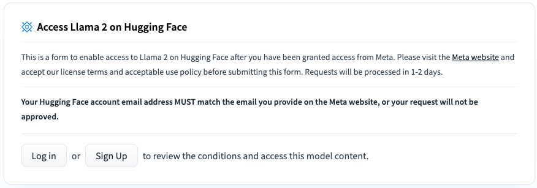
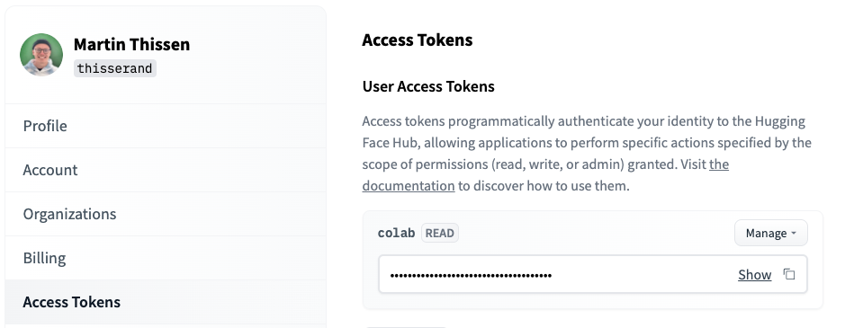

# Llama2 on Your Local Computer
Run the new Llama2 and Llama2-Chat models on your local computer.

## Getting Started

### Installation

1. Clone the repository:
```
git clone https://github.com/thisserand/llama2_local.git
cd llama2_local
```

2. Install required dependencies:
```
pip install -r requirements.txt
```

### Prerequisites
To be able to download the model weights and tokenizer from Huggingface, you firtst need to visit the [Meta AI website](https://ai.meta.com/resources/models-and-libraries/llama-downloads/) and accept their License (my request got approved within 30 minutes). Make sure that you state the email address that you are also using for your Huggingface account. Once your request got accepted, you need to go to one of the Llama2 Huggingface repositories (e.g., the Llama2-7B model) and request access for there again, as can be seen in the following image (access should be granted right away):


Once you are all set with your access requests the last step is to login to your huggingface account in your current runtime. For this we will use the following command:
```
huggingface-cli login
```
You can find your Access Token here (https://huggingface.co/settings/tokens):


## Usage

### Full Precision (Original)

Llama2-7B:
```
python llama.py --model_name="meta-llama/Llama-2-7b-hf"
```
Llama2-7B-Chat:
```
python llama.py --model_name="meta-llama/Llama-2-7b-chat-hf"
```
Llama2-13B:
```
python llama.py --model_name="meta-llama/Llama-2-13b-hf"
```
Llama2-13B-Chat:
```
python llama.py --model_name="meta-llama/Llama-2-13b-chat-hf"
```
Llama2-70B:
```
python llama.py --model_name="meta-llama/Llama-2-70b-hf"
```
Llama2-70B-Chat:
```
python llama.py --model_name="meta-llama/Llama-2-70b-chat-hf"
```
### GPTQ Quantized
Llama2-7B:
```
python llama.py --model_name="TheBloke/Llama-2-7B-GPTQ"
```
Llama2-7B-Chat:
```
python llama.py --model_name="TheBloke/Llama-2-7b-Chat-GPTQ"
```
Llama2-13B:
```
python llama.py --model_name="TheBloke/Llama-2-13B-GPTQ"
```
Llama2-13B-Chat:
```
python llama.py --model_name="TheBloke/Llama-2-13B-Chat-GPTQ"
```
Llama2-70B:
```
python llama.py --model_name="TheBloke/Llama-2-70B-GPTQ"
```
Llama2-70B-Chat:
```
python llama.py --model_name="TheBloke/Llama-2-70B-Chat-GPTQ"
```
### GGML Quantized
Llama2-7B:
```
python llama.py --model_name="TheBloke/Llama-2-7B-GGML" --file_name="llama-2-7b.ggmlv3.q4_K_M.bin"
```
Llama2-7B-Chat:
```
python llama.py --model_name="TheBloke/Llama-2-7B-Chat-GGML" --file_name="llama-2-7b-chat.ggmlv3.q4_K_M.bin"
```
Llama2-13B:
```
python llama.py --model_name="TheBloke/Llama-2-13B-GGML" --file_name="llama-2-13b.ggmlv3.q4_K_M.bin"
```
Llama2-13B-Chat:
```
python llama.py --model_name="TheBloke/Llama-2-13B-Chat-GGML" --file_name="llama-2-13b-chat.ggmlv3.q4_K_M.bin"
```